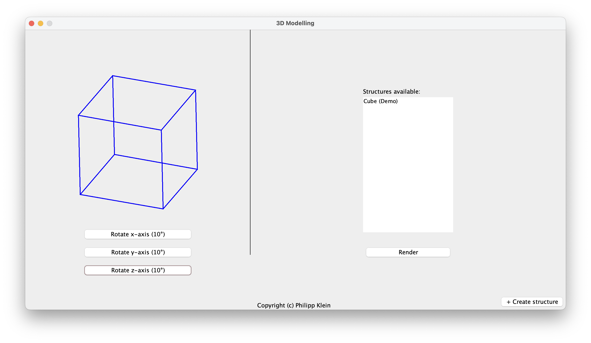
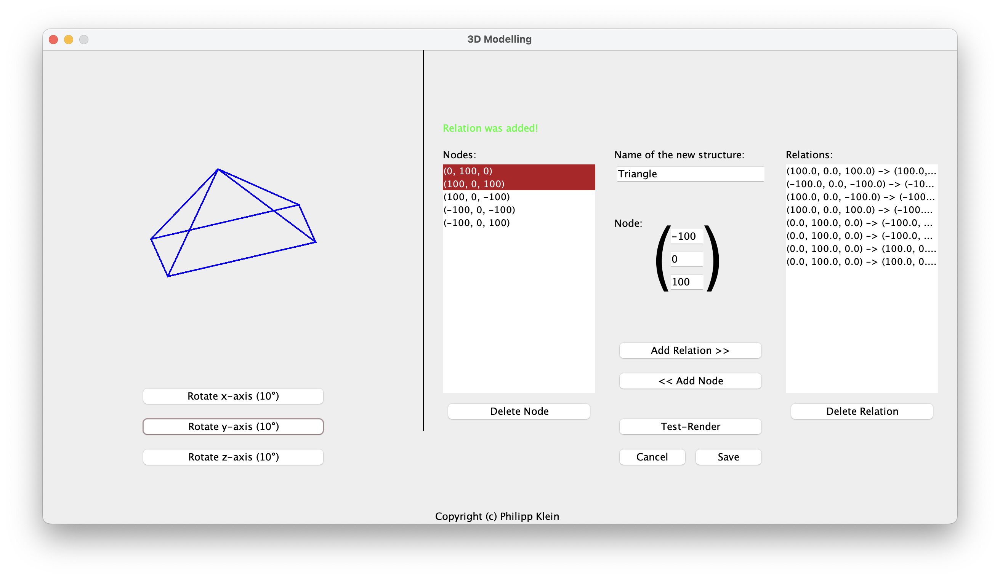

<h1>3D Modelling</h1>
<i>Published on: Monday, 01.29.2024 </i>
<i>Languages: Java </i>
<i>Version: 1.0 </i>

 

[Get Documentation](documents/3D_Modelling_Documentation.pdf)

This application allows you to create, view and interact with three-dimensional objects or structures all in one, window. The GUI was made (again) using JFrames.

When you launch the software, you’ll be on the main screen, where you can render and rotate your created structures. There is also a cube structure as a demo.

On the left side of the screen, you’ll find the rendering area for the structure. You can rotate it using the buttons at the bottom. To create a new structure, click the ‘+ Create structure’ button in the bottom right corner. To select a structure for rendering, select one in the list and press the ’Render’ button.

After pressing the ’+ Create structure’ button on the main screen, you’ll find yourself on the Creator screen. On this screen, you have the following options:

<ol>
          <li><b>Naming Your Structure</b>: Upon entering the creator screen, you’ll see a text field labeled ’Name of the new structure’. Here, you can give your structure a unique name.</li>
           
          <li><b>Adding Nodes</b>: In this software, I refer to vectors or points as ’Nodes’. To add a Node, locate the field inside the graphical representation of the vector/point. Here, you can type in the coordinates of the Node you wish to add. There will be placeholders for the coordinates to help you.</li>
           
          <li><b>Creating Relations</b>: To create a structure, you’ll have to add relations between Nodes. Remember, a relation can only be made between two Nodes, otherwise an error will be given out. Once you’ve selected two Nodes, you can create a relation between them.</li>
           
          <li><b>Deleting Nodes and Relations</b>: If you need to remove a Node or a relation, you can do so by selecting them from their respective lists. Once selected, press the ’Delete’ button located at the bottom of each list.</li>
           
          <li><b>Test Rendering and Rotation</b>: The software allows you to test render your structure. This means you can view your structure as it would appear when rendered. Additionally, you can rotate your structure around the x, y, and z-axis by 10 degrees, similar to the main screen.</li>
        </ol>
