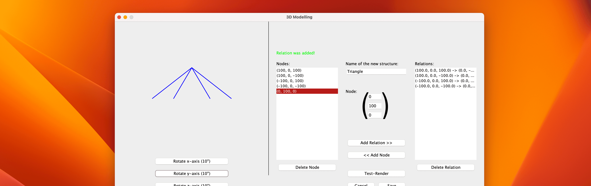

# 3D Modelling
This application allows you to create, view and interact with three-dimensional objects or structures all in one, window. The GUI was made (again) using JFrames. If you want to know everything about this program, I've made a PDF, that you can access here (GitHub): [Documentation (coming soon)](documents/3D_Modelling_Documentation.pdf)
